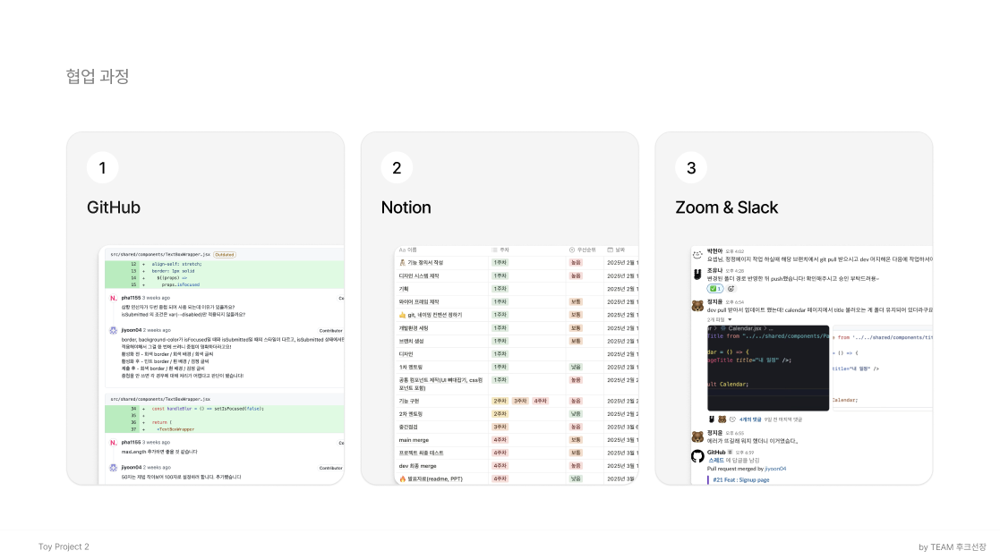

## 프로젝트 소개

H&B 급여 관리 시스템 Sweet Tan은 직원들의 급여 및 급여 정정 신청을 효율적으로 관리할 수 있도록 설계된 웹 애플리케이션입니다. 본 프로젝트는 React.js와 Firebase를 기반으로 개발되었으며, Redux를 활용하여 상태 관리를 수행합니다.

## 팀원 소개

<div align="center">
<table>
<tr>
<td align="center">
<a href="https://github.com/YosepAhn">

</a>
<br />
<strong>안요셉</strong>
<br />
<p>정정 신청/ 내역(직원) <br/>

공통 컴포넌트 작업 <br>

toast 알림

</p>
</td>
<td align="center">
<a href="https://github.com/pha1155">

</a>
<br />
<strong>박현아</strong>
<br />
<p>내 일정(캘린더) <br/>

Layout & Header <br>

css & 공통 컴포넌트 작업

</p>
</td>
<td align="center">
<a href="https://github.com/j0n0m2">

</a>
<br />
<strong>조유나</strong>
<br />
<p> 로그인 & 회원가입<br/>

정정 신청 / 내역 (관리자)<br/>

디자인 <br/>

routing

</p>
</td>
<td align="center">
<a href="https://github.com/jiyoon04">

</a>
<br />
<strong>정지윤</strong>
<br />
<p>급여 확인 (직원 & 관리자)<br/>

내 일정(캘린더) <br/>

공통 컴포넌트 작업 <br/>

프로필 이미지 업로드<br/>

routing & Redux

</p>
</td>
</tr>
</table>
</div>

## 프로젝트 실행 방법

1. `.env` 파일 설정: API 키를 안전하게 보관하기 위해 `.env` 파일을 생성하고, 필요한 환경 변수를 설정합니다.
2. 프로젝트 클론:

   ```
   git clone [repository-url]
   cd hnb-payroll-system

   ```

3. 패키지 설치:

   ```
   npm install

   ```

4. 프로젝트 실행:

   ```
   npm run dev

   ```

## 페이지 소개 및 주요 기능

### 1. 로그인 / 회원가입 (Auth)

- Firebase Authentication을 활용한 회원가입 및 로그인 기능
- 이메일/비밀번호 로그인 방식
- 사용자 데이터를 Firestore에 저장
- Redux Store를 활용한 상태 관리

### 2. 내 일정 (Calendar)

- useModal 커스텀 훅을 활용하여 모달 구현
- 일정 추가, 조회, 수정, 삭제(CRUD) 기능 구현
- 로그인한 직원의 일정 Firestore DB 연동
- 라벨 색상으로 일정 구분 표시

### 3. 급여 확인 (Salary)

- 로그인한 직원의 급여 정보를 Firestore에서 불러와 월별로 렌더링
- Redux Store를 활용하여 개인 정보를 유지하고, 필요 시 Firestore에서 재조회

### 4. 정정 내역 / 신청 (Salary Adjustment)

- **useModal 커스텀 훅**을 활용한 모달 창 구현
- **로그인한 사용자가 급여 정정 신청 가능**
- **자신의 정정 내역을 Firestore에서 조회 가능**
- **신청 내역을 Firebase Firestore에 저장 및 관리**

### 5. 정정 신청 / 내역 관리 - Admin

- 모든 직원의 정정 신청 내역 열람 가능
  - 정정 신청 처리 상태를 기준으로 내역 필터링 조회 가능
- 모든 직원의 정정 신청 승인 및 반려 기능 구현
  - 수정된 정정 신청 정보를 기반으로 Firestore 해당 문서 업데이트

## 폴더 구조

```
📦src
 ┣ 📂pages
 ┃ ┣ 📂auth
 ┃ ┣ 📂calendar
 ┃ ┣ 📂employeeList
 ┃ ┣ 📂salary
 ┃ ┗ 📂salaryAdjustment
 ┣ 📂shared
 ┃ ┣ 📂components
 ┃ ┣ 📂styles
 ┃ ┣ 📂config
 ┃ ┣ 📂header
 ┃ ┣ 📜firebase.js
 ┃ ┗ 📜Layout.jsx
 ┣ 📂store
 ┣ 📜App.jsx
 ┗ 📜main.jsx

```

<div >
<h2 align="center"> Tech Stacks</h2>

<h3>Frontend</h3>
<div align="center">


</div>

<h3>Backend</h3>
<div align="center">

</div>

</div>

<br />

<div>
<h2 align="center"> Tools</h2>
<br />
<div align="center">


</div>
</div>

## 브랜치 전략

- `main` : 배포용 브랜치
- `dev` : 개발 브랜치
- `feature/[기능명]` : 기능 개발 브랜치

## 커밋 컨벤션

```jsx
# 제목은 최대 50글자까지 아래에 작성: ex) Feat: Add Key mapping

# 본문은 아래에 작성

# 꼬릿말은 아래에 작성: ex) Github issue #23

# --- COMMIT END ---
#   <타입> 리스트
#   Feat        : 기능 (새로운 기능)
#   Fix         : 버그 (버그 수정)
#   Refactor    : 리팩토링
#   Design      : CSS 등 사용자 UI 디자인 변경
#   Comment     : 필요한 주석 추가 및 변경
#   Style       : 스타일 (코드 형식, 세미콜론 추가: 비즈니스 로직에 변경 없음)
#   Docs        : 문서 수정 (문서 추가, 수정, 삭제, README)
#   Test        : 테스트 (테스트 코드 추가, 수정, 삭제: 비즈니스 로직에 변경 없음)
#   Chore       : 기타 변경사항 (빌드 스크립트 수정, assets, 패키지 매니저 등)
#   Init        : 초기 생성
#   Rename      : 파일 혹은 폴더명을 수정하거나 옮기는 작업만 한 경우
#   Remove      : 파일을 삭제하는 작업만 수행한 경우
# ------------------
#   제목 첫 글자를 대문자로
#   제목은 명령문으로
#   제목 끝에 마침표(.) 금지
#   제목과 본문을 한 줄 띄워 분리하기
#   본문은 "어떻게" 보다 "무엇을", "왜"를 설명한다.
#   본문에 여러줄의 메시지를 작성할 땐 "-"로 구분
# ------------------
#   <꼬리말>
#   필수가 아닌 optioanl
#   Fixes        :이슈 수정중 (아직 해결되지 않은 경우)
#   Resolves     : 이슈 해결했을 때 사용
#   Ref          : 참고할 이슈가 있을 때 사용
#   Related to   : 해당 커밋에 관련된 이슈번호 (아직 해결되지 않은 경우)
#   ex) Fixes: #47 Related to: #32, #21

```

## 네이밍 컨벤션

```
- 변수: camelCase
- 상수: SNAKE_CASE (대문자)
- 함수: camelCase, 동사로 시작 ex) onClick
- 컴포넌트: arrow function
- 포멧터: Prettier / ESLint (w. Airbnb style guide)

```

## 문서 템플릿

```markdown
### 📄 Describe

설명을 적어요.

### ✅ Tasks

- [ ] 투두리스트를 적어요.

### 📋 Ref

추가적인 정보나 참고 문서를 적어요.
```

```markdown
✨ Related Issues

- 이슈 넘버 #[issue_number]

## 📝 Task Details

- 이 곳에 진행한 업무를 작성해주세요!

## 📂 References

- 스크린샷이나 레퍼런스를 넣어주세요!

## 💖 Review Requirements

- 리뷰 요구사항을 적어주세요!
```

## 타임 라인


## 협업 과정


